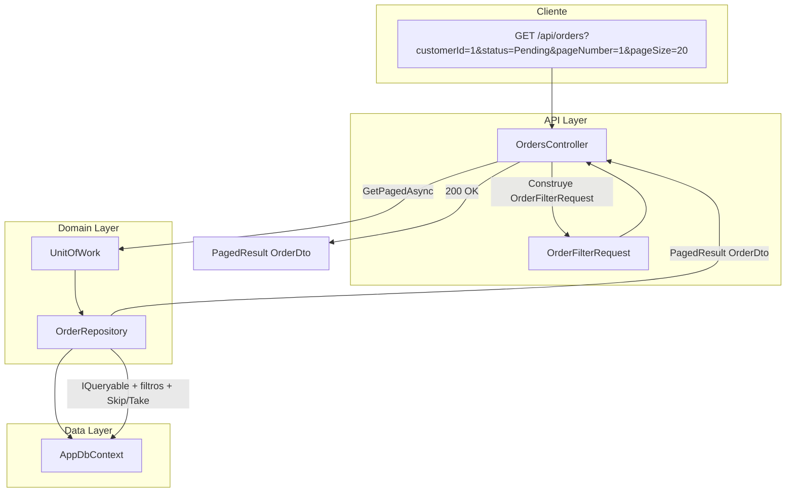

# Plan: API .NET 8 - Endpoint GET /api/orders paginado

## Estructura del proyecto

Se creará una solución .NET 8 con un único proyecto Web API y la siguiente estructura de carpetas:

```
Curso_IA_dev_v2/
├── Api/                          # Nuevo proyecto .NET 8
│   ├── Controllers/
│   │   └── OrdersController.cs
│   ├── DTOs/
│   │   ├── OrderFilterRequest.cs
│   │   ├── OrderDto.cs
│   │   └── PagedResult.cs
│   ├── Entities/
│   │   ├── Order.cs
│   │   └── OrderStatus.cs
│   ├── Data/
│   │   └── AppDbContext.cs
│   ├── Repositories/
│   │   ├── IRepository.cs
│   │   ├── BaseRepository.cs
│   │   ├── IOrderRepository.cs
│   │   └── OrderRepository.cs
│   ├── UnitOfWork/
│   │   ├── IUnitOfWork.cs
│   │   └── UnitOfWork.cs
│   ├── Program.cs
│   └── Api.csproj
```

## 1. Entidades y DbContext


**OrderStatus** ([Api/Entities/OrderStatus.cs](Api/Entities/OrderStatus.cs)):

- `Pending`, `Processing`, `Shipped`, `Delivered`, `Cancelled`

**AppDbContext**: DbSet de Order, configuración para SQL Server o SQLite (in-memory para desarrollo).

## 2. DTOs

**OrderFilterRequest** ([Api/DTOs/OrderFilterRequest.cs](Api/DTOs/OrderFilterRequest.cs)):

- `CustomerId` (int?)
- `Status` (OrderStatus?)
- `DateFrom` (DateTime?)
- `DateTo` (DateTime?)
- `PageNumber` (int, default 1)
- `PageSize` (int, default 10, max 100)

**OrderDto** ([Api/DTOs/OrderDto.cs](Api/DTOs/OrderDto.cs)):

- Id, CustomerId, OrderDate, TotalAmount, Status

**PagedResultT** ([Api/DTOs/PagedResult.cs](Api/DTOs/PagedResult.cs)):

- `Items` (IEnumerableT)
- `TotalCount` (int)
- `PageNumber` (int)
- `PageSize` (int)
- `TotalPages` (int)

## 3. Repositorios

**IRepositoryT** y **BaseRepositoryT** ([Api/Repositories/](Api/Repositories/)):

- `GetAll()`, `GetById()`, `Add()`, `Update()` según especificación.

**IOrderRepository** y **OrderRepository**:

- Hereda/implementa la lógica de BaseRepository.
- Método `GetPagedAsync(OrderFilterRequest request)` que:
  - Aplica filtros opcionales (CustomerId, Status, DateFrom, DateTo) de forma independiente.
  - Cuenta total con `Count()`.
  - Aplica `Skip()` y `Take()` para paginación (sin librerías externas).
  - Devuelve `PagedResult<OrderDto>`.
  - Sin `Include()`; solo datos de Order.

## 4. Unit of Work

**IUnitOfWork** y **UnitOfWork**:

- Propiedad `Orders` (IOrderRepository).
- Método `SaveChangesAsync()`.

## 5. Controller

**OrdersController** ([Api/Controllers/OrdersController.cs](Api/Controllers/OrdersController.cs)):

- `GET /api/orders` con query params: `customerId`, `status`, `dateFrom`, `dateTo`, `pageNumber`, `pageSize`.
- Construye `OrderFilterRequest` desde query string.
- Valida `PageSize` máximo 100.
- Llama a `_unitOfWork.Orders.GetPagedAsync(request)`.
- Retorna `PagedResult<OrderDto>`.

## 6. Registro de servicios

En `Program.cs`:

- DbContext (SQLite in-memory o SQL Server según preferencia).
- `IUnitOfWork` -> `UnitOfWork`.
- `IOrderRepository` -> `OrderRepository`.
- Seed de datos de prueba opcional para desarrollo.

## Diagrama de flujo




## Restricciones aplicadas

- Sin librerías externas de paginación.
- Sin `Include()` de navegaciones.
- Filtros opcionales e independientes.
- Máximo 100 items por página.
- Comentarios XML en métodos públicos.

## Dependencias NuGet

- Microsoft.EntityFrameworkCore
- Microsoft.EntityFrameworkCore.Sqlite (o SqlServer)
- Microsoft.EntityFrameworkCore.Design (para migraciones)

